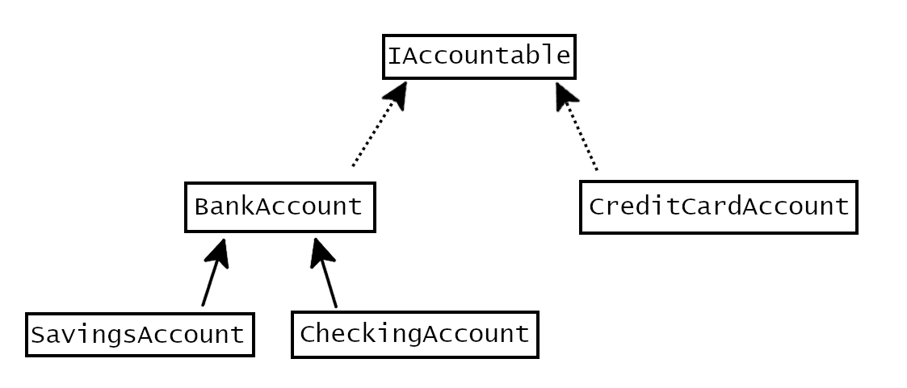

#### The `BankAccount` class

The `BankAccount` class represents a simple checking or savings account at a bank.

Implement the `BankAccount` class.

| Constructor                                                              | Description                                                                                                                         |
| ------------------------------------------------------------------------ | ----------------------------------------------------------------------------------------------------------------------------------- |
| BankAccount(String accountHolderName, String accountNumber)              | A new bank account requires an account holder name and account number. The balance defaults to a 0 dollar balance if not specified. |
| BankAccount(String accountHolderName, String accountNumber, int balance) | A new bank account requires an account holder name and account number. The balance is initialized to the dollar balance given.      |

| Property Name     | Data Type | Get | Set     | Description                                                  |
| ----------------- | --------- | --- | ------- | ------------------------------------------------------------ |
| AccountHolderName | string    | X   |         | Returns the account holder name that the account belongs to. |
| AccountNumber     | string    | X   | X       | Returns the account number that the account belongs to.      |
| Balance           | decimal   | X   | private | Returns the balance value of the bank account in USD.        |

| Method Name                        | Return Type | Description                                                                                             |
| ---------------------------------- | ----------- | ------------------------------------------------------------------------------------------------------- |
| Deposit(decimal amountToDeposit)   | decimal     | Adds `amountToDeposit` to the current balance, and returns the new balance of the bank account.         |
| Withdraw(decimal amountToWithdraw) | decimal     | Subtracts `amountToWithdraw` from the current balance, and returns the new balance of the bank account. |
| TransferTo(BankAccount destinationAccount, int transferAmount) | int       | Withdraws `transferAmount` from this account and deposits it into `destinationAccount`. |

---
##### Test Cases

Can we test this directly?

---

#### The `SavingsAccount` class

A `SavingsAccount` "is-a" `BankAccount`, but it also has some additional rules:

| Override Method | Description                                                                                                                              |
| --------------- | ---------------------------------------------------------------------------------------------------------------------------------------- |
| Withdraw        | If the current balance is less than $150.00 when a withdrawal is made, an additional $2.00 service charge is withdrawn from the account. |
| Withdraw        | If a withdrawal is requested for more than the current balance, the withdrawal fails and balance remains the same. No fees are incurred. |

---
##### Test Cases

| Method | Test Case | Expected Outcome |
| ------ | --------- | ---------------- |
| Constructors | Execute each constructor | Test values in 3 properties |
| Withdraw | Current balance is >= 150 | No service charge |
| Withdraw | Current balance < 150 | $2 service charge |
| Withdraw | amt > current balance | No withdrawal (balance does not change) |
| Withdraw | amt = current bal - 1 | Fail, balance does change |
| Withdraw | amt negative | fail, balance does not change |
| Deposit | positive, zero, negative amounts | Balance changes appropriately |

---
#### The `CheckingAccount` class

A `CheckingAccount` "is-a" `BankAccount`, but it also has some additional rules:

| Override Method | Description                                                                                                                                                             |
| --------------- | ----------------------------------------------------------------------------------------------------------------------------------------------------------------------- |
| Withdraw        | If the balance falls below $0.00, a $10.00 overdraft fee is also withdrawn from the account.                                                                            |
| Withdraw        | Checking account can't be overdrawn by $100.00 or more. If a withdrawal request leaves the account $100 or more overdrawn, it fails and the balance remains the same. |

---
##### Test Cases

| Method | Test Case | Expected Outcome |
| ------ | --------- | ---------------- |
| Constructors | Execute each constructor | Test values in 3 properties |

---
#### The `IAccountable` interface

The `IAccountable` interface means that an object can be used in the accounting process for the customer.

| Attribute Name | Return Type | Description                                          |
| -------------- | ----------- | ---------------------------------------------------- |
| `Balance`      | `int`       | Returns the balance value of the account in dollars. |

---
##### Test Cases

Can we test this directly?

---
#### The `CreditCardAccount` class

A `CreditCardAccount` isn't a `BankAccount` but "can-do" `Accountable`.

| Constructor                                                         | Description                                                                                                            |
| ------------------------------------------------------------------- | ---------------------------------------------------------------------------------------------------------------------- |
| `CreditCardAccount(string accountHolderName, string accountNumber)` | A new credit card account requires an account holder name and account number. The debt defaults to a 0 dollar balance. |

| Attribute Name      | Data Type | Get | Set | Description                                                  |
| ------------------- | --------- | --- | --- | ------------------------------------------------------------ |
| `AccountHolderName` | `string`  | X   |     | Returns the account holder name that the account belongs to. |
| `AccountNumber`     | `string`  | X   |     | Returns the account number that the account belongs to.      |
| `Debt`              | `int`     | X   |     | Returns the amount the customer owes.                        |

| Method Name                  | Return Type | Description                                                                       |
| ---------------------------- | ----------- | --------------------------------------------------------------------------------- |
| `Pay(int amountToPay)`       | `int`       | Removes `amountToPay` from the amount owed and returns the new total amount owed. |
| `Charge(int amountToCharge)` | `int`       | Adds `amountToCharge` to the amount owed and returns the new total amount owed.   |

---
##### Test Cases

| Method | Test Case | Expected Outcome |
| ------ | --------- | ---------------- |
| Constructor | Execute each constructor | Test values in properties |

---
#### The `BankCustomer` class

Implement the `BankCustomer` class. A bank customer "has-a" list of `Accountable`s.

| Attribute Name | Data Type | Get | Set | Private | Description                                                                                     |
| -------------- | --------- | --- | --- | ------- | ----------------------------------------------------------------------------------------------- |
| `Name`         | `string`  | X   | X   |         | Returns the name of the bank customer.                                                          |
| `Address`      | `string`  | X   | X   |         | Returns the address of the bank customer.                                                       |
| `PhoneNumber`  | `string`  | X   | X   |         | Returns the phone number of the bank customer.                                                  |
| `IsVip`        | `bool`    | X   |     |         | Calculates the balance of all accounts, returns `true` if at least $25,000; otherwise is false. |
| `accounts`     | ???       | X   |     | X       | Returns the customer's list of `Accountable`s as an array.                                      |

| Method Name                          | Return Type      | Description                                              |
| ------------------------------------ | ---------------- | -------------------------------------------------------- |
| `AddAccount(Accountable newAccount)` | `void`           | Adds `newAccount` to the customer's list of accounts.    |
| `GetAccounts()`                      | `IAccountable[]` | Returns array of the accounts belonging to the customer. |

---
##### Test Cases

| Method | Test Case | Expected Outcome |
| ------ | --------- | ---------------- |
|  |  |  |

---
